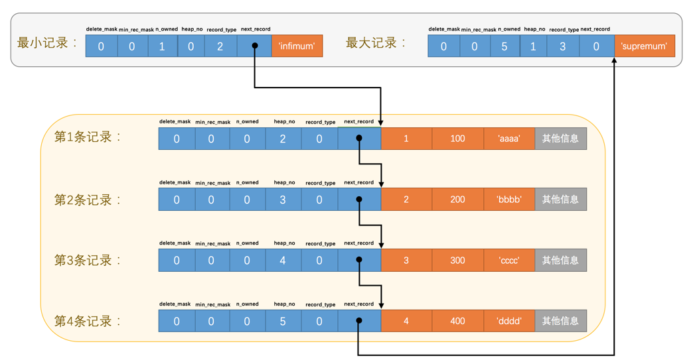
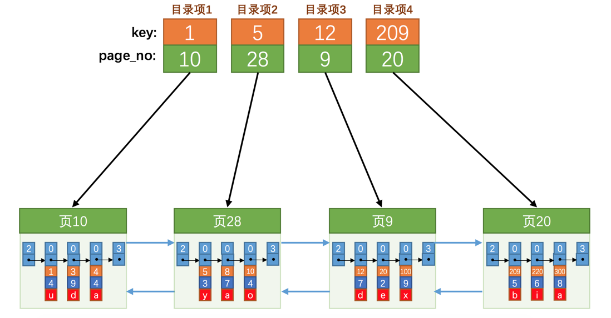

# MySQL 索引

---

数据的存储并不是按表顺序存储，而是随机的，所以需要使用索引来组织查询顺序。

## 1. InnoDB 的数据存储

MySQL 中使用页作为磁盘内存交互数据和数据存储的基本单位，页大小一般为 16KB。当一条记录包含的数据太多，超出了一页的大小时，多出的数据会被存放在其他页中，这种现象叫做行溢出。

为了便于区分和管理，InnoDB 将页分为了多种类型，其中用于存放数据的页叫做数据页。数据页中的 User Records 区域就是存放用户数据的部分。

User Records 中存放的每一条记录都会带有 next_record 字段，它存放着当前记录中数据的地址到下一条记录中数据的地址的偏移量，也就是说，**数据页中的每一条记录按照主键从小到大的顺序构成了一条单向链表**。



为了提高单链表的查找效率，将页中所有记录分组，每组最后一条记录中数据的地址作为索引层，构成了类似**跳表**的结构。这些抽取出来的地址叫做槽，存放在页的 Page Directory 区域，每个槽拥有序号。


所以在一个数据页中查找一条记录分为两步：

* 使用二分法查找记录所在的槽
* 顺序遍历链表

每个数据页的 File Header 区域存放了上一页和下一页的信息，**数据页之间构成双向链表**。


如果不使用索引，查找时需要在多个数据页构成的双向链表中遍历，并且在单页中查找记录，效率十分低下。

## 2. 索引

为了加快对数据页的查找，抽取出若干目录结构，**每个目录结构中存储一个数据页的页号和页中记录的最小主键**。这样通过对比主键就能够快速定位记录所在的数据页，这种抽取与数据页内对槽的抽取十分类似，目录结构与数据页也形成了类似跳表的结构。



在 InnoDB 中，上述的目录结构采用了数据页来存储，每条记录的 record_type 字段用来区分中这条记录是用户数据还是索引数据，数据页中的多条索引记录和用户数据记录一样形成链表，数据页之间也根据主键形成有序的双向链表。对于索引数据，数据部分只有两列，对应一个数据页的页号和此页中记录的最小主键。

将存放索引数据的数据页逐层向上抽取，索引数据页与用户数据页就形成了 B+ 树结构。


## 3. 索引类型

**[聚簇索引](#clustered_index)**：上述索引结构中，存放索引的页和存放数据的页都在一棵 B+ 树结构中，这种将用户数据和索引数据在同一个结构中存储的方式就叫做聚簇索引。显然这种数据存放方式只能根据主键来进行查找，InnoDB 会自动为主键建立索引，如果没有主键则会自动添加 row_id 作为主键。

**二级索引**：在使用非主键（如 non_primary1）查找时，需要新构建一棵以这个列为索引的 B+ 树，与以主键为索引不同：

* 索引页存放的是 non_primary1 和页号
* 数据页存储的是 non_primary1 和主键
* 索引页和数据页的记录都按照 non_primary1 的大小排序

所以使用非主键查找时需要先在辅助索引中查找到记录的主键，再根据主键查找到完整的记录，这个过程叫做**回表**。

**联合索引**：联合索引就是使用多个列（如 non_primary1 和 non_primary2）建立 B+ 树结构，与二级索引不同的是，页内记录和页之间依次按照 non_primary1 和 non_primary2 的大小来排序，叶子节点存储的也是 non_primary1、non_primary2 和主键。需要注意的是，**使用不同列建立的二级索引对应多棵 B+ 树结构，而联合索引只有一棵 B+ 树结构**。

举例说明，如果联合索引是（A，B，C）：

* 先按照 A 排序
* 对于 A 值相等的按照 B 排序
* 对于 AB 都相等的按照 C 排序

**MyISAM 使用的索引**：虽然也使用 B+ 树作为索引结构，但是索引数据和用户数据分开存储：

* 用户数据按照插入顺序在连续的空间上存储，类似于数组，使用行号访问
* 索引数据使用单独的 B+ 树结构，与 InnoDB 类似，可以以主键索引，也可以以非主键或联合列来索引，只是所有索引中叶子节点存储的都是行号，也就是说 **MyISAM 中的索引全都是二级索引**。

MySQL 中使用时的索引类型：

* normal：普通索引
* unique：唯一索引，不允许重复
* full text：全文索引，通过关键字匹配，进行相似度计算来查找，性能远高于 like %，但可能出现精度问题

## 4. 索引的匹配

**全值匹配**：考虑现有使用（C1，C2，C3）建立的联合索引，索引会按照 C1、C2、C3 的顺序依次对记录进行排序。当进行等值匹配查找时，如果搜索条件中列的顺序和建立联合索引的列顺序一致，那么搜索条件三个列的值都会在索引过程中使用到，可以直接确定主键。若顺序不同，则无法利用到索引。

当然搜索时不必用到联合索引的所有列，包含左边的部分列也能够使用到索引，只是不如全值匹配效率高，但是顺序也必须与联合索引中列的顺序相同。

**前缀匹配**：对于使用字符串列建立的索引，只使用前缀进行查找是可以使用到索引的，因为已经字符串排序完成，那么前缀肯定也是有序的，但如果使用中间的某几个字符就无法使用索引，类似最左匹配和全值匹配的关系。

**范围匹配**：对多个列同时进行范围查找时，只有对索引最左边的那个列进行范围查找的时候才能用到索引：

```sql
select * from test where name > 'Bob' and name < 'Charlie' and age > 20
```

对于上述查询，如果联合索引为（name，age）：

* 首先会先根据 name 的两个边界进行过滤，这个过程是可以使用到索引的，因为 name 字段在索引中已经排序好
* 然后根据 age 过滤，但是这个过程不会用到索引，因为根据前边说的联合索引的排序规则，age 在索引中只在 name 相等时才会有序，但是前边根据 name 边界查出的数据，显然一般情况下 name 相等的数据很少，所以 age 列几乎无法使用到索引。

当然如果在范围匹配条件前存在等值匹配，那么范围匹配中的第一个列仍然可以使用索引。

**排序 / 分组**：当时使用 order by / group by 时，如果子句后边列的顺序与联合索引列的顺序一致，也能够使用到索引。

## 5. 索引的使用

**考虑列的基数**：列的基数指一列中所有不重复数据的个数，基数越大，说明数据越分散，就能够过滤掉更多的数据。选择此列构建索引，或者将此列放在最左。

**索引字符串列的前缀**：B+ 树索引需要包含完整的列数据，长字符串会导致索引十分庞大，如果只对字符串的前几个字符建立索引，也能大概确定查找范围，用查找时间换取空间。

**使用联合索引**：联合索引相比单列索引支持更多种查询组合，如（A，B，C）的联合索引能支持 ABC、AB、A 这三种查找。

**独立使用索引列**：索引列参与表达式运算或作为函数参数时无法使用索引。

**按顺序插入主键**：由于 B+ 树结构的原因，无序的主键插入会导致 B+ 树频繁变动结构。

**[覆盖索引](#cover_index)**：联合索引能够覆盖查询时用到的列，这种索引就是覆盖索引：

```sql
select name, age, sex from test where name = 'Bob'
```

如果联合索引为（name，age，sex），因为索引结构中存储了这些列的值，不需要再通过主键查找完整的记录，所以查询成本很低。但需要注意的是，只有能够存储列数据的索引才能成为覆盖索引，而如 Hash 索引等其他不能存储记录中列的值的索引则无法成为覆盖索引。

这也是为什么不推荐使用 select * 原因：无法使用覆盖索引。

**禁止列为 null**：不利于索引优化，使列的基数计算更复杂，占用更多存储空间。
