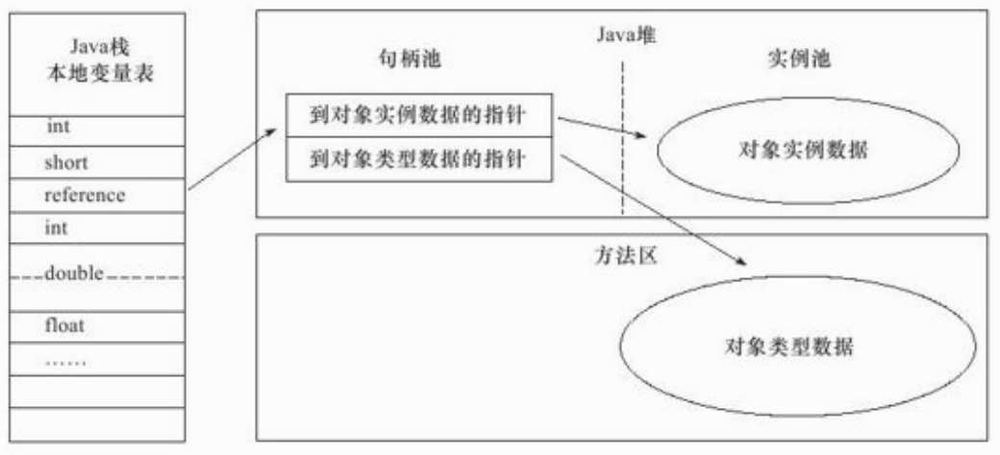
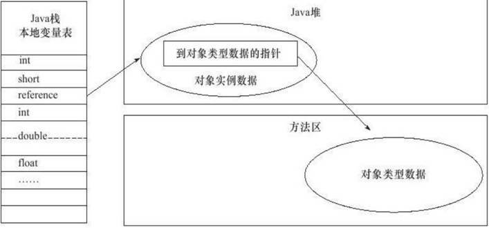

# JVM 基础

---

## 1. 运行时区域

分区的意义在于针对不同类型的数据抽象出不同的区域以便于管理。

**程序计数器**：线程私有，可以看作是当前线程所执行字节码的行号指示器。

**栈**：线程私有，生命周期与线程相同，用来描述方法执行的模型。每个方法执行时都会在栈中创建一个栈帧存放局部变量表、操作数栈、动态连接和方法出口信息等。方法执行完毕后栈帧出栈，内存区域被释放。

* **动态连接**：字节码中的方法调用指令是以常量池中方法的符号引用作为参数的，这些符号引用在类加载阶段或运行期被转化为直接引用，一些确定的方法如静态方法、构造方法、私有方法及父类方法，它们会在类加载的[解析阶段](../class_and_instance/class_and_instance.md#resolve)就会被转化为直接引用，称为静态解析，而其他方法在运行期被转化，称为动态连接。

**本地方法栈**：与栈类似，用来执行 native 方法。

**堆**：线程共享，GC 的主要区域，存储实例对象和各种类型（包括基本数据类型）的数组。

**方法区**：线程共享，存储已经被 JVM 加载的类的相关信息，包括：

* 类的基本信息：类 or 接口、类的全限定名、访问修饰符等
* 类的详细信息：运行时常量池、**类变量（静态变量）**、**指向 Class 对象的引用**、**指向 ClassLoader 的引用**等

  > 运行时常量池：Java 代码编译后的 class 文件中存在一项内容为常量池，包含了编译期生成的各种字面量、final 常量值及符号引用，这部分内容在类加载后会存放至运行时常量池。需要注意的是，Java 不要求常量必须在编译期产生，也就是说运行期也可能产生常量而被放入运行时常量池。

需要注意的是，**Class 对象并不在方法区中**，方法区只有指向 Class 对象的引用。

## 2. 对象的访问

栈中只保存了对象的引用，对象的实例存储在堆中访问对象通常有两种方式：

句柄：

直接指针：

直接指针的方式相比少了一次指针定位。需要注意的是，不论哪种方式，**通过引用必须能同时访问到对象的实例数据和对象的类数据**。
